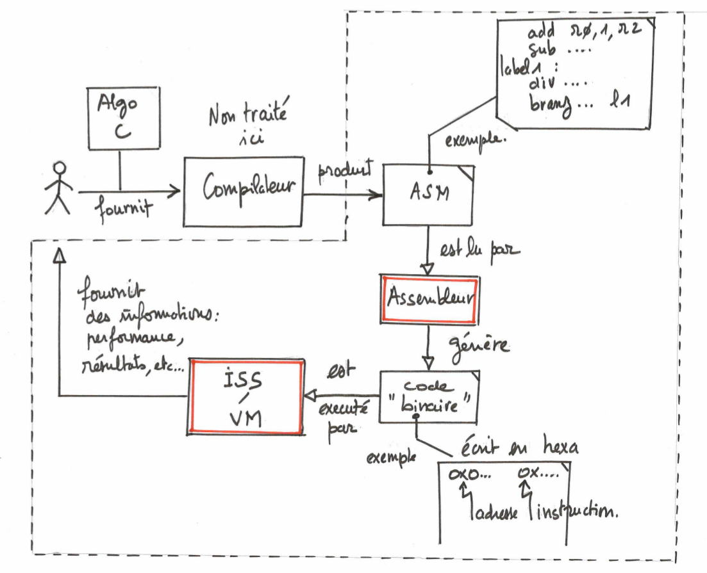
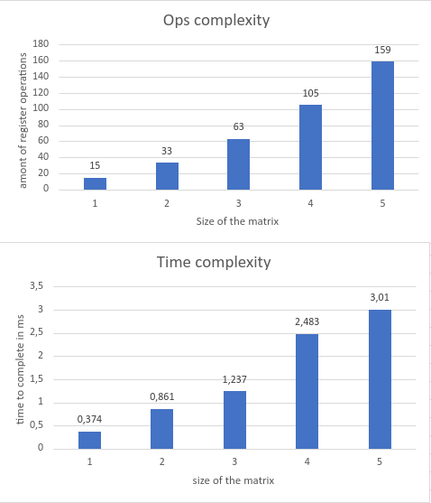

# C-SIMJI

The goal of the project is to create an assembly program in python to translate written instructions into numbered instructions, then running them on a custom VM (ISS) using miniMIPS instruction set. It's a school project for ENSTA bretagne.

I took for inspiration the VMinC tutorial here : https://en.wikibooks.org/wiki/Creating_a_Virtual_Machine/Register_VM_in_C

## Running the project 

### Build instruction list from assembly file 

to only build the instruction file, just type : 

```bash
python3 bin/assembleur.py file.asm
```

Where ```file.asm``` is the assembly file you want to compile. Here's a syntax example for my assembly language (comments not supported): 

```assembly
add r0,1,r1
label: add r2,r3,r4
jmp label,r0
stop
```

You'll find the corresponding instruction file in `bin` directory. 

### Execute a binary file

To execute a binary file, type ```make``` in the project root. This will automatically build the corresponding binary. You can also only ```run``` and ```build``` 

### Do both in one command 

I added a script ```launch.sh``` that is building the instruction file then compiling and running the corresponding binary. Here's how to use it: 

```bash
chmod +x launch.sh
./launch.sh
```

The default asm source is `command.asm`. You'll find the source along other asm example files in the ```asm``` directory. 

## Some explanations 

The project is an exercice designed to help us understand assembly and instruction set. 

MiniMIPS instruction set : 


project overview : 



*Project schematics courtesy of @JC-LL* 	

Here are the major points to consider regarding my work : 

* The ISS is written in c for performance, the assembly program is written in python for easier syntax. 

* Regarding the assembly syntax, due to the way i parse the lines in python, make sure to NOT INCLUDE SPACES BEFORE INSTRUCTIONS. Also the comments are not implemented yet (in a completed line, to comment use an other line) . 

* For each instruction, you'll get the states of the registers in the terminal along with the written instructions corresponding to the line like that : 

  ```bash
  add r0 1 r1 imm=1
  regs = 00000000 00000001 00000000 00000000 00000000 00000000 00000000 00000000 00000000 00000000 00000000 00000000 00000000 00000000 00000000 00000000 00000000 00000000 00000000 00000000 00000000 00000000 00000000 00000000 00000000 00000000 00000000 00000000 00000000 00000000 00000000 00000000
  ```

  *(imm (immediate) is equal to 1 if the value is immediate, 0 is the value is the address of a register)*

* After all the instructions have been executed, you'll get a performance overview of the program you ran : 

  ```bash
  ==================END=================
  Benchmark results : 
  ops complexity : 10 operations 
  number of CPU ticks 279 
  time complexity : 0.279 ms 
  ```

  ops complexity is the amount of register operations needed to complete the program. then comes the number of CPU "ticks" it took to the computer to run the program, and finally you'll find the time needed to complete the program in milliseconds (timer stops while `scall 0` is waiting for user input). 

* The projects supports two's complement when passing direct values. 

* Cache is not currently supported, but memory is (access memory using `store` and `load` )

## Benchmarking 

To measure the performance of my software, i added .asm files corresponding to the square of a 3x3 or NxN matrix (courtesy of @JC-LL). 

I used `matrixNxN.asm` to benchmark the ISS, with matrix full of one and by variating the size of the matrix. Here are the results 




